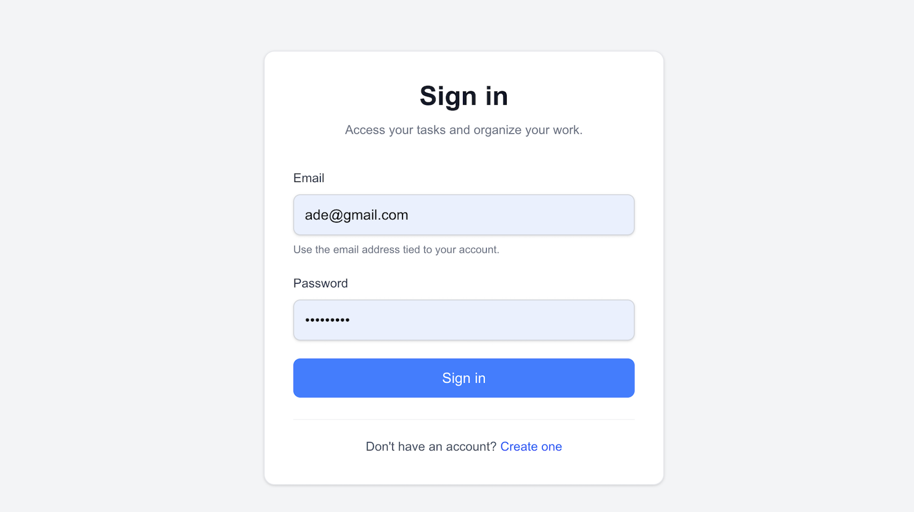
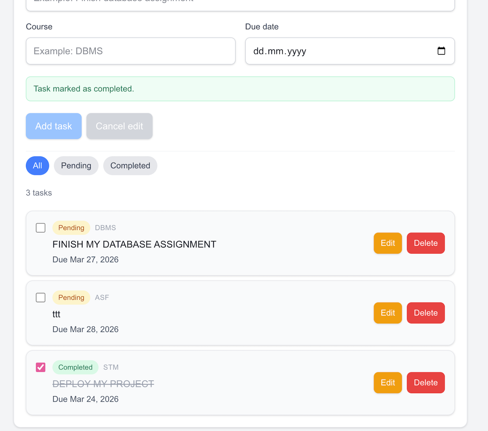
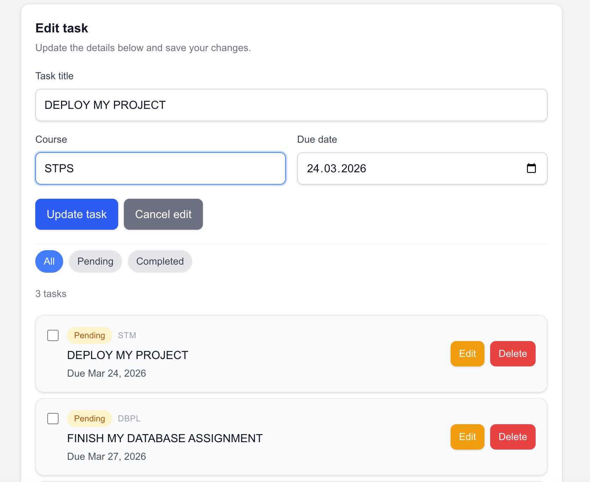

# Student Task Manager

A focused task management app for students to track coursework, deadlines, and completion status in a simple authenticated workspace.

## Overview

This project is a full-stack Next.js app with credentials-based authentication and a Postgres database. Each user can create, edit, complete, filter, and delete their own tasks, with server-side ownership checks protecting task data.

## Key Features

- Secure sign up, sign in, and sign out
- Protected app routes for authenticated users only
- User-scoped task ownership
- Create, edit, delete, and complete/incomplete task actions
- Pending, completed, and all-task filters
- Optimistic task updates for a faster-feeling UI
- Clear empty, loading, success, and error states

## Tech Stack

- Next.js 16
- React 19
- TypeScript
- Tailwind CSS 4
- Prisma
- PostgreSQL
- NextAuth.js
- bcryptjs

## Screenshots


### Login


### Sign up


### Dashboard


### Tasks View


## Setup

1. Install dependencies:

```bash
npm install
```

2. Create your local environment file:

```bash
cp .env.example .env
```

3. Update the values in `.env`.

4. Run the database migrations:

```bash
npx prisma migrate dev
```

5. Start the development server:

```bash
npm run dev
```

Open `http://localhost:3000`.

## Environment Variables

Use the following variables in `.env`:

```env
DATABASE_URL="postgresql://USER@localhost:5432/student_tasks?host=/tmp"
NEXTAUTH_SECRET="replace-this-with-a-long-random-secret"
NEXTAUTH_URL="http://localhost:3000"
```

- `DATABASE_URL`: PostgreSQL connection string
- `NEXTAUTH_SECRET`: secret used to sign and verify auth tokens
- `NEXTAUTH_URL`: base URL for local auth callbacks

## Database Migrations

Apply the current schema:

```bash
npx prisma migrate dev
```

If you want Prisma Client regenerated after schema changes:

```bash
npx prisma generate
```

## Auth Notes

- The main app route (`/`) is protected.
- Unauthenticated users are redirected to `/login`.
- Authenticated users are redirected away from `/login` and `/signup`.
- Task API routes check the current session server-side.
- Tasks are always queried and mutated with the signed-in user’s `id`.

## Scripts

- `npm run dev` — start the local development server
- `npm run build` — create a production build
- `npm run start` — run the production server
- `npm run lint` — run ESLint

## Portfolio Notes

This project is intentionally small and focused. The emphasis is on clean full-stack fundamentals: authentication, protected data access, task CRUD, optimistic updates, and a polished beginner-friendly UI.
